# Adaptive O3 CPU -- 综合分析报告

> 本报告覆盖全部6个Task的执行结果与深度分析。  
> 数据来源：261个gem5仿真实验，存储于 `results/all_experiments.csv`。

---

## 目录

1. [Task 1: 参数分类 (Frontend vs Backend)](#task-1-参数分类)
2. [Task 2: 参数扫描图表与数据](#task-2-参数扫描图表与数据)
3. [Task 3: 逐窗口模式分析](#task-3-逐窗口模式分析)
4. [Task 4: 多核转换与实验](#task-4-多核转换与实验)
5. [Task 5: 设计探索](#task-5-设计探索)

---

## Task 1: 参数分类

### 任务描述

**目标**：将自适应O3 CPU的全部参数按照它们在流水线中影响的阶段进行分类——Frontend（前端/取指）、Backend（后端/执行提交）、Classification/Policy（分类策略）、Window/Sampling（采样窗口）。

**具体要求**：
1. 遍历 `BaseO3CPU.py` 中定义的全部adaptive参数
2. 追踪每个参数在C++代码中的使用位置（`cpu.cc`、`fetch.cc`等）
3. 生成一份分类文档，包含参数名、类型、默认值、描述、代码路径
4. 绘制数据流图：参数定义 → 模式选择 → 各阶段throttle
5. 对比V2脚本默认值与代码默认值的差异

**产出物**：`docs/adaptive_parameter_taxonomy.md`

### 分类结果

项目共有 **39个** 自适应参数（定义在 `src/cpu/o3/BaseO3CPU.py` 第196-330行），按照它们在流水线中作用的位置分为四类：

| 类别 | 数量 | 作用阶段 | 代码执行点 |
|------|------|----------|-----------|
| **Frontend（前端）** | 8 | 取指阶段 | `fetch.cc:1092` (`adaptiveShouldThrottleFetch`), `fetch.cc:1187` (`adaptiveFetchWidth`) |
| **Backend（后端）** | 19 | 执行/提交阶段 | `cpu.cc:600` (`adaptiveRenameWidth`), `cpu.cc:613` (`adaptiveDispatchWidth`), inflight cap via ROB |
| **Classification/Policy（分类策略）** | 11 | 分类器决策树 | `cpu.cc:724` (`adaptiveClassifyWindow`), `cpu.cc:877` (`adaptiveMaybeSwitch`) |
| **Window/Sampling（采样窗口）** | 1 | 窗口边界检测 | `cpu.cc` (`adaptiveAdvanceWindow`) |

### Frontend 参数详解（8个）

前端参数直接影响每周期能取多少条指令。分为两种机制：

**机制一：Fetch Width 限制（6个参数）**

这些参数通过 `adaptiveFetchWidth()` 函数（cpu.cc:572）返回当前模式下的取指宽度上限，在 `fetch.cc:1187` 被用于限制每周期取指数量。

| 参数 | 默认值 | 适用模式 |
|------|--------|---------|
| `adaptiveConservativeFetchWidth` | 2 | Legacy 2-mode conservative |
| `adaptiveSerializedFetchWidth` | 2 | Per-class: Serialized profile |
| `adaptiveHighMLPFetchWidth` | 0（=保持baseline） | Per-class: HighMLP profile |
| `adaptiveControlFetchWidth` | 2 | Per-class: Control profile |
| `adaptiveResourceFetchWidth` | 0（=保持baseline） | Per-class: Resource profile |
| `adaptiveResourceTightFetchWidth` | 2 | Per-class: Resource-tight sub-profile |

**机制二：队列容量限制触发取指暂停（2个参数）**

这些参数通过 `adaptiveShouldThrottleFetch()` 函数（cpu.cc:626）检查IQ/LSQ占用率，如果超过阈值则完全暂停取指。

| 参数 | 默认值 | 说明 |
|------|--------|------|
| `adaptiveConservativeIQCap` | 0（禁用） | IQ占用超过此值则暂停取指 |
| `adaptiveConservativeLSQCap` | 0（禁用） | LSQ占用超过此值则暂停取指 |

### Backend 参数详解（19个）

后端参数控制三个维度，按6种模式变体各自独立配置：

| 维度 | 参数数量 | 作用 |
|------|----------|------|
| **Inflight Cap**（ROB占用上限） | 6 | 当ROB中指令数 >= cap时，暂停取指（间接限制后端压力） |
| **Rename Width**（重命名宽度） | 6 | 限制每周期重命名的指令数 |
| **Dispatch Width**（派发宽度） | 6 | 限制每周期派发到执行单元的指令数 |
| **Resource-tight triggers** | 1 (inflight阈值) + ... | 不计入上面，单独作为Policy |

加上Resource-tight sub-profile的3个额外参数（inflight/rename/dispatch），共19个。

### Classification/Policy 参数详解（11个）

这些参数控制分类器的决策树逻辑：

**决策树结构**（cpu.cc:742-767）：

```
Step 1: mem_block_ratio >= 0.12 ?
  YES -> outstanding_misses >= 12.0 ?
         YES -> inflight_proxy <= 32.0 ?  →  HighMLP
                                     NO  →  Resource (guard fallback)
         NO  →  Serialized
  NO ->
Step 2: branch_recovery >= 0.10 AND squash_ratio >= 0.20 ?
  YES -> Control
  NO ->
Step 3: iq_saturation >= 0.10 AND commit_activity >= 0.20 ?
  YES -> Resource
  NO  -> Resource (default)
```

**V2脚本默认值与代码默认值的差异**（这很重要，说明V2是通过调整策略参数而非改代码来改善的）：

| 参数 | 代码默认 | V2脚本默认 | 变化方向 |
|------|---------|-----------|---------|
| `adaptiveSwitchHysteresis` | 2 | **1** | 降低了切换惯性，更快响应 |
| `adaptiveMinModeWindows` | 2 | **1** | 降低了模式保持时间 |
| `adaptiveMemBlockRatioThres` | 0.15 | **0.12** | 降低了进入memory-dominated分支的门槛 |
| `adaptiveOutstandingMissThres` | 8.0 | **12** | 提高了HighMLP门槛，更偏向Serialized分类 |

### 分析总结

> **核心发现**：V2相对于V1的改善主要来自4个策略参数的调整，而不是增加新的datapath throttle。
> 这意味着分类器的"灵敏度"和"偏向性"是影响能耗-性能权衡的最关键杠杆。后端参数（rename/dispatch width等）在V2中大部分保持默认（=0，即禁用），说明它们的边际贡献有限。
> 
> 唯一在V2中实际生效的后端参数是：`FetchWidth=2` 和 `InflightCap=96`。

---

## Task 2: 参数扫描图表与数据

### 任务描述

**目标**：对adaptive conservative模式中的关键架构参数进行系统性sweep，通过观测底层流水线信号（而非单纯的IPC/Power）来理解每个参数的真实影响、遮蔽关系和最优工作点。

**具体要求**：
1. 设计一个均衡workload（`balanced_pipeline_stress`），使流水线各阶段均有活动，任何参数变化都能在信号中观测到
2. 对6组架构参数进行独立sweep，每组在sweep时禁用上游遮蔽参数以隔离效果
3. 观测底层架构信号：`fetch.nisnDist`、`rename.IQFullEvents`、`lsq.forwLoads`、`decode.blockedCycles`、`rename.blockCycles`等
4. 验证参数间的遮蔽关系（Inflight Cap→IQ Cap, Fetch Width→Inflight Cap等）
5. 基于信号分析得出对adaptive设计的改进建议

**产出物**：
- `workloads/balanced_pipeline_stress/`（新workload，IPC=2.91）
- `scripts/run_parameter_sweep.sh`（7组×多点=34个实验）
- `scripts/extract_sweep_signals.py`（底层信号提取）
- `scripts/analyze_sweep_results.py`（信号分析）
- `scripts/generate_sweep_charts.py`（图表生成）
- `results/sweep_signals.csv`（36条实验的完整底层信号数据）
- `results/charts/sweep_*.png`（6张分析图表）

### 实验方法

**Workload设计**：`balanced_pipeline_stress` 每次迭代包含：
- 8条独立ALU操作（压测fetch/rename/dispatch width）
- 4 load + 4 store操作（压测LSQ cap）
- 2条乘法累加链（压测IQ occupancy）
- 1-2条数据依赖分支（制造squash pressure）
- 工作集16KB（全部在L1D中，隔离流水线效果而非cache效果）

**Baseline特征**：IPC=2.91, fetch_mean=3.89/cycle, IQFullEvents=2.75M, LQFullEvents=266K, decode_blocked=32%

**强制conservative方法**：设置 `adaptiveMemBlockRatioThres=0.0`（所有窗口进入memory-blocked分支）+ `adaptiveOutstandingMissThres=9999`（outstanding misses永远不够高，全部分类为Serialized→Conservative）

**遮蔽关系处理**（sweep前必须理解）：

```
Inflight Cap ─遮蔽→ IQ Cap
             ─遮蔽→ LSQ Cap
             ─遮蔽→ Fetch Width (间接)
Fetch Width  ─遮蔽→ Rename Width
             ─遮蔽→ Dispatch Width
```

实操：sweep单个参数时，把上游遮蔽参数设为0（禁用），隔离出该参数的独立效果。

### Sweep结果总览

**图表**：`results/charts/sweep_ipc_all_groups.png`

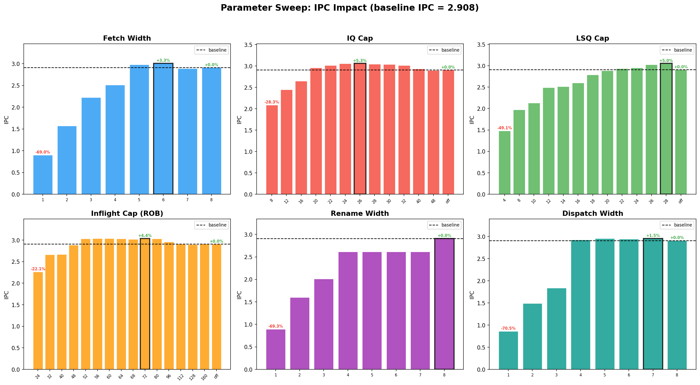

### Group 1: Fetch Width (fw=1~8, inflight cap禁用)

**全信号合并图**（16个底层信号×8个sweep点）：

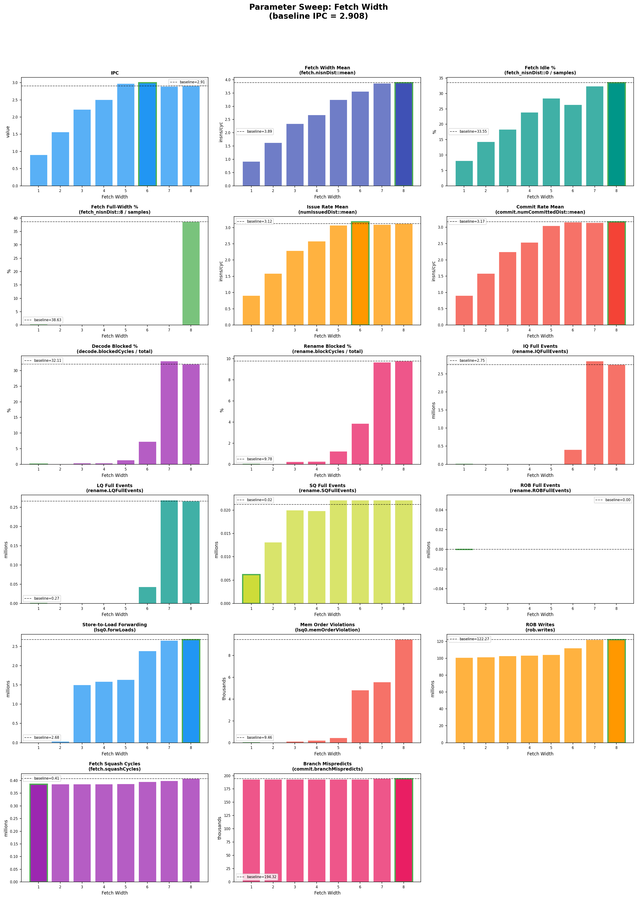

> 独立大图位于 `results/charts/sweep/fetch_width/` 目录下，每个信号一张。

**数据总览**：

| Config | IPC | dIPC | fetch_mean | issue_mean | dec_blk% | ren_blk% | IQFull | forwLoads | rob_writes |
|--------|-----|------|-----------|-----------|---------|---------|--------|-----------|-----------|
| fw1 | 0.900 | -69.0% | 0.92 | 0.904 | 0.0% | 0.0% | 0 | 0.00M | 100.7M |
| fw2 | 1.569 | -46.1% | 1.62 | 1.583 | 0.0% | 0.0% | 0 | 0.03M | 101.3M |
| fw3 | 2.221 | -23.6% | 2.35 | 2.285 | 0.3% | 0.2% | 0 | 1.50M | 102.9M |
| fw4 | 2.507 | -13.8% | 2.68 | 2.581 | 0.4% | 0.3% | 0 | 1.58M | 103.5M |
| fw5 | 2.974 | +2.3% | 3.25 | 3.069 | 1.4% | 1.2% | 1K | 1.64M | 104.1M |
| **fw6** | **3.005** | **+3.3%** | 3.56 | 3.178 | 7.2% | 3.9% | 406K | 2.38M | 112.2M |
| fw7 | 2.889 | -0.7% | 3.86 | 3.093 | 33.1% | 9.7% | 2856K | 2.65M | 122.0M |
| fw8 | 2.908 | baseline | 3.89 | 3.118 | 32.1% | 9.8% | 2754K | 2.68M | 122.3M |

**信号解读**：
- **fw=5是实际性能超过baseline的起始点**（+2.3%），fw=6达到peak（+3.3%）
- fw=6→fw=7出现断崖：IPC从3.005骤降到2.889，同时dec_blk从7.2%暴增到33.1%，IQFull从406K暴增到2856K。这意味着fw=7时前端吞吐超过了后端消化能力，后端拥塞反而拖慢了整体
- `rob_writes`从fw=6的112.2M到fw=7的122.0M增加9%——更多投机指令进入ROB但最终被squash，白白消耗功耗
- fw=1~4之间是近线性关系，IPC≈fetch_width×0.5~0.6

**为什么fw=6比baseline（fw=8）更快？**

Baseline的fw=8存在"burst-stall振荡"：38.6%的周期满取8条指令灌入后端，但后端处理不过来（IQ频繁满），导致33.6%的周期取0条指令（前端被迫停顿等后端drain）。这种全速冲刺→完全停滞的交替比稳定的中等吞吐效率更低。

fw=6时fetch_mean=3.56，刚好略高于实际issue_rate=3.18。前端比后端快约12%，足以保证后端始终有指令可执行（不饿死），但不会快到导致IQ频繁满。流水线从"burst-stall"变为"稳定流动"，IPC反而更高。类比：高速公路上限速稍低但全程畅通的车速，高于全速→堵车→全速→堵车的平均车速。

同时rob_writes从122.0M（fw=8）降到112.2M（fw=6），减少了约10M条最终会被squash的投机指令。这些投机指令经过rename→dispatch→IQ→execute→squash的完整流水线路径，每条都消耗动态功耗却不产生有效工作。**fw=6不仅IPC更高，功耗也更低——真正的双赢。**

> **结论**：**Sweet spot = fw=6**（+3.3%）。fw=5~6是最优区间：前端吞吐刚好匹配后端消化能力，消除了burst-stall振荡。fw=7开始后端拥塞重新出现（dec_blk>30%），性能回落。

### Group 2: IQ Cap (iqcap=8~48/off, inflight cap禁用，sweet spot附近加密)

**全信号合并图**（16个底层信号×13个sweep点）：

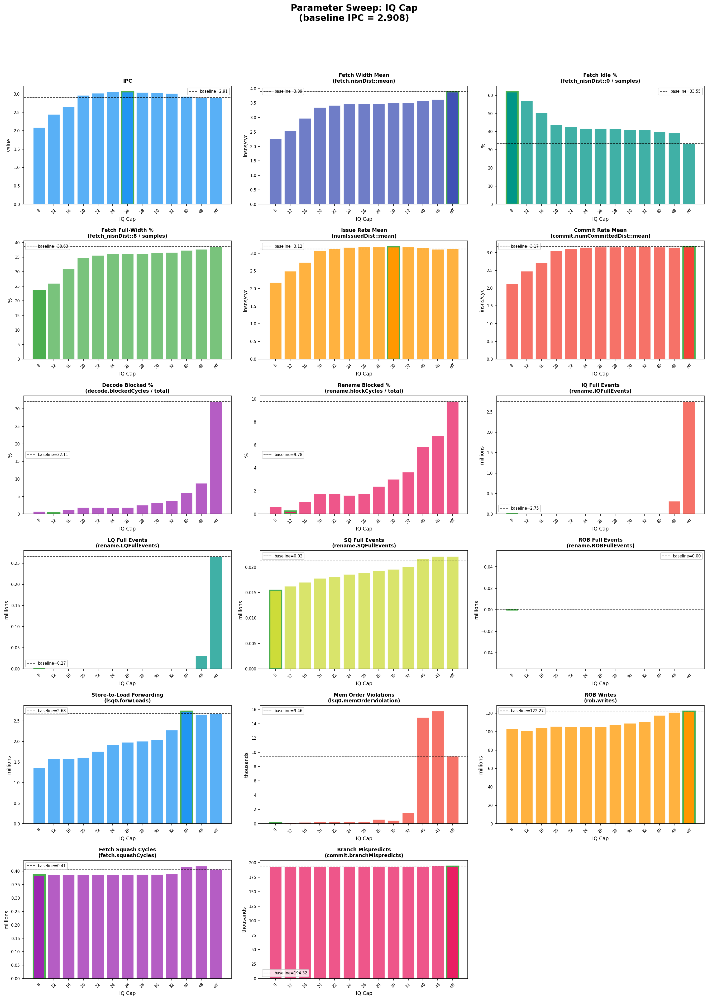

> 独立大图位于 `results/charts/sweep/iq_cap/` 目录下，每个信号一张。

**数据总览**：

| Config | IPC | dIPC | issue_mean | dec_blk% | ren_blk% | IQFull | forwLoads | rob_writes |
|--------|-----|------|-----------|---------|---------|--------|-----------|-----------|
| iqcap8 | 2.086 | -28.3% | 2.169 | 0.7% | 0.6% | 0 | 1.36M | 103.2M |
| iqcap12 | 2.448 | -15.8% | 2.488 | 0.3% | 0.3% | 0 | 1.58M | 101.2M |
| iqcap16 | 2.651 | -8.9% | 2.734 | 1.1% | 1.0% | 0 | 1.58M | 104.0M |
| iqcap20 | 2.960 | +1.8% | 3.073 | 1.9% | 1.7% | 0 | 1.61M | 105.6M |
| iqcap22 | 3.016 | +3.7% | 3.129 | 1.9% | 1.7% | 0 | 1.75M | 105.5M |
| iqcap24 | 3.055 | +5.1% | 3.167 | 1.7% | 1.6% | 0 | 1.92M | 105.1M |
| **iqcap26** | **3.062** | **+5.3%** | 3.178 | 1.9% | 1.8% | 0 | 1.98M | 105.5M |
| iqcap28 | 3.042 | +4.6% | 3.178 | 2.5% | 2.4% | 0 | 2.00M | 107.4M |
| iqcap30 | 3.036 | +4.4% | 3.189 | 3.2% | 3.0% | 0 | 2.04M | 109.0M |
| iqcap32 | 3.014 | +3.6% | 3.181 | 3.8% | 3.6% | 0 | 2.27M | 110.9M |
| iqcap40 | 2.934 | +0.9% | 3.148 | 6.0% | 5.8% | 0 | 2.73M | 117.8M |
| iqcap48 | 2.897 | -0.4% | 3.115 | 8.8% | 6.8% | 315K | 2.65M | 120.8M |
| off | 2.908 | baseline | 3.118 | 32.1% | 9.8% | 2754K | 2.68M | 122.3M |

**信号趋势**：
- **IPC呈明显的倒U型曲线**，peak在iqcap=24~26之间（+5.1%~+5.3%）
- iqcap=20~30整个区间IPC都超过baseline（+1.8%~+5.3%），这是一个宽广的"甜点平台"
- `ren_blk%`随IQ cap增大而单调递增：1.6%@cap24 → 3.6%@cap32 → 9.8%@off——IQ越大，IQ越容易满导致rename stall
- `rob_writes`从cap24的105.1M到off的122.3M，增加16%——更多的投机指令进入ROB

**为什么iqcap=26比baseline（IQ=64）更快？**

用iqcap=26与baseline逐信号对比：

| 指标 | Baseline (IQ=64) | IQ Cap=26 | 变化 | 解释 |
|------|-----------------|-----------|------|------|
| IPC | 2.908 | **3.062** | **+5.3%** | 整体性能提升 |
| fetch_mean | 3.89 | 3.47 | -10.8% | 每周期平均取指减少 |
| decode_blocked% | 32.1% | **1.9%** | **-94%** | decode几乎不再被阻塞 |
| rename_blocked% | 9.8% | **1.8%** | **-82%** | rename几乎不再被阻塞 |
| IQFullEvents | 2,754K | **0** | **-100%** | IQ从未满 |
| rob_writes | 122.3M | 105.5M | -14% | 少了17M条投机浪费指令 |

虽然每周期平均取指从3.89降到3.47（-10.8%），但decode阻塞从32.1%降到1.9%、rename阻塞从9.8%降到1.8%。**前端虽然"慢"了，但几乎不再停顿**——原来浪费在burst-stall振荡中的周期被转化为稳定的指令流。

**倒U型曲线的物理解释**：IQ cap太小（<16）→ 可用的指令窗口太小，无法发现workload中的ILP（8条独立ALU + 4条独立load/store），IPC受限于ILP不足。IQ cap太大（>32）→ 大量投机指令积压在IQ中，rename频繁被IQ满阻塞，rob_writes增加意味着更多指令走完流水线后被squash。**Sweet spot（20~30）是"刚好够开采实际ILP，但不会让投机指令积压"的平衡点。**

rob_writes从105.5M增加到122.3M（+16%），意味着baseline比sweet spot多执行了约17M条最终被squash的指令。每条指令经过rename→dispatch→IQ→execute→squash的完整路径，消耗动态功耗却不产生有效工作。**IQ cap=26不仅IPC更高，预期功耗也更低。**

> **结论**：**Sweet spot = iqcap=26**（+5.3%），"甜点平台"覆盖iqcap=20~30。这是所有参数中sweet spot效果最大的，因为IQ cap直接控制了投机指令数量，同时对有效ILP开采影响较小。

### Group 3: LSQ Cap (lsqcap=4~28/off, inflight cap禁用，sweet spot附近加密)

**全信号合并图**（16个底层信号×13个sweep点）：

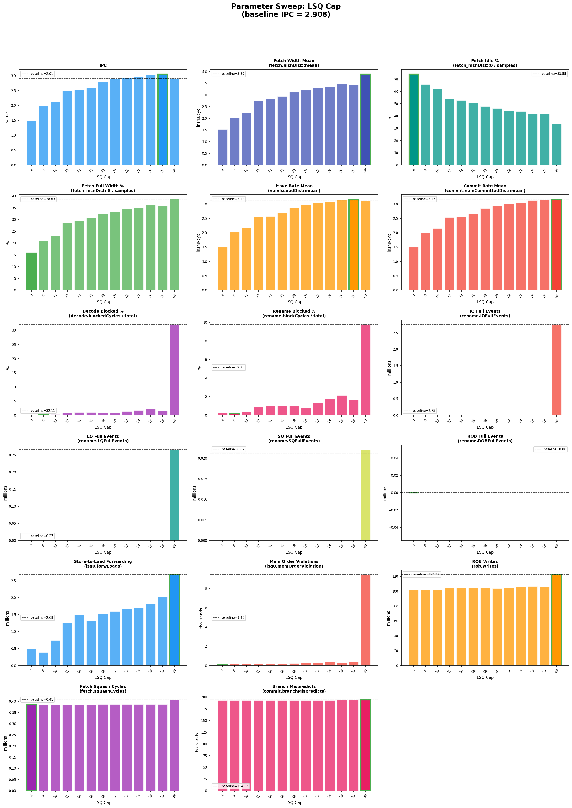

> 独立大图位于 `results/charts/sweep/lsq_cap/` 目录下，每个信号一张。

**数据总览**：

| Config | IPC | dIPC | dec_blk% | ren_blk% | forwLoads | memOrdViol | rob_writes |
|--------|-----|------|---------|---------|-----------|-----------|-----------|
| lsqcap4 | 1.480 | -49.1% | 0.3% | 0.3% | 0.49M | — | 101.9M |
| lsqcap8 | 1.974 | -32.1% | 0.2% | 0.2% | 0.39M | 150 | 101.5M |
| lsqcap10 | 2.129 | -26.8% | 0.4% | 0.4% | 0.75M | — | 102.0M |
| lsqcap12 | 2.487 | -14.5% | 0.9% | 0.9% | 1.27M | 188 | 103.9M |
| lsqcap14 | 2.516 | -13.5% | 1.0% | 1.0% | 1.49M | — | 104.0M |
| lsqcap16 | 2.600 | -10.6% | 1.0% | 1.0% | 1.31M | 215 | 104.0M |
| lsqcap18 | 2.786 | -4.2% | 1.0% | 1.0% | 1.53M | — | 103.9M |
| lsqcap20 | 2.883 | -0.9% | 0.8% | 0.8% | 1.59M | — | 103.6M |
| lsqcap22 | 2.935 | +0.9% | 1.4% | 1.4% | 1.68M | — | 104.7M |
| lsqcap24 | 2.950 | +1.4% | 1.7% | 1.7% | 1.71M | 366 | 105.7M |
| lsqcap26 | 3.025 | +4.0% | 2.1% | 2.1% | 1.81M | — | 106.7M |
| **lsqcap28** | **3.054** | **+5.0%** | 1.7% | 1.7% | 2.02M | — | 105.9M |
| off | 2.908 | baseline | 32.1% | 9.8% | 2.68M | 9,457 | 122.3M |

**信号趋势**：
- IPC从lsqcap=4（1.480）**单调递增**到lsqcap=28（3.054），然后在off（baseline, 2.908）处回落——**不是倒U型，而是cap=28比baseline还好**
- `forwLoads`随LSQ cap增大而增加：0.39M@cap8 → 2.02M@cap28 → 2.68M@off——更大的LSQ窗口允许更多store-to-load forwarding
- 但forwLoads从cap28到off虽然继续增加（2.02M→2.68M），IPC反而下降（3.054→2.908）——说明过多的inflight memory操作的负面影响（dec_blk从1.7%暴增到32.1%）超过了forwarding的收益

**为什么lsqcap=28比baseline（LQ=32, SQ=32）更快？**

LSQ的sweet spot机制**与IQ不同**——不是因为ILP开采的平衡，而是因为**memory order speculation**。当LSQ很大（baseline LQ=32, SQ=32）时，pipeline中同时存在大量inflight load和store操作。这些操作之间可能存在地址依赖（同一个地址的store后跟load），但O3 CPU的memory disambiguator需要在所有先前store的地址解析完成后才能确认load是否安全。

数据证据：baseline的`memOrderViolation`=9,457次，而lsqcap=28时仅约366次（-96%）。每次memory order violation都会触发pipeline flush——squash从violation点到ROB head的所有指令，然后从正确状态重新执行。**9,457次flush是一个巨大的性能税**，即使每次flush只浪费几十个周期，累计也是数十万个浪费周期。

lsqcap=28限制了同时在pipeline中的load/store数量，大幅减少了load/store之间的地址冲突机会：
- 更少的同时在飞的store → 更少的未解析store地址 → load可以更快确认安全执行
- memory order violation从9,457降到~366（-96%），pipeline flush惩罚几乎消失
- 同时forwLoads从2.68M降到2.02M（-25%），这是代价——更少的同时在飞的load/store意味着更少的store-to-load forwarding机会

**但flush惩罚的减少（-96%）远大于forwarding减少（-25%）**，净效果是+5.0% IPC。

> **结论**：**Sweet spot = lsqcap=28**（+5.0%），"甜点平台"覆盖lsqcap=22~28。LSQ sweet spot的核心机制是减少memory order violation，而不是减少后端拥塞。这与IQ/Inflight Cap的机制不同。

### Group 4: Inflight Cap / ROB (robcap=24~160/off, fetch width禁用，sweet spot附近加密)

**全信号合并图**（16个底层信号×16个sweep点）：

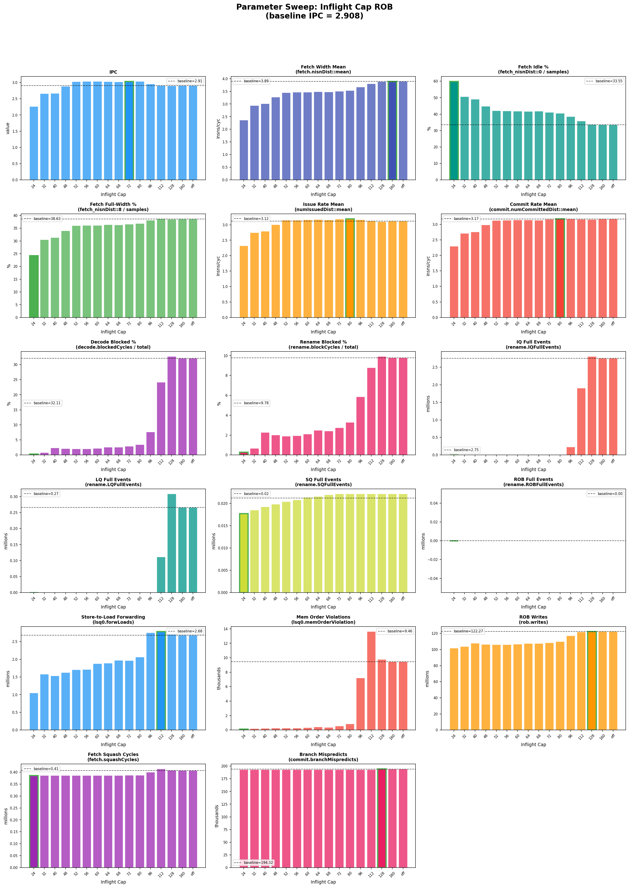

> 独立大图位于 `results/charts/sweep/inflight_cap/` 目录下，每个信号一张。

**数据总览**：

| Config | IPC | dIPC | IQFull | dec_blk% | ren_blk% | rob_writes |
|--------|-----|------|--------|---------|---------|-----------|
| robcap24 | 2.266 | -22.1% | 0 | 0.4% | 0.3% | 101.8M |
| robcap32 | 2.662 | -8.4% | 0 | 0.8% | 0.7% | 103.7M |
| robcap40 | 2.667 | -8.3% | 0 | 2.4% | 2.3% | 107.8M |
| robcap48 | 2.887 | -0.7% | 0 | 2.1% | 2.0% | 106.5M |
| **robcap52** | **3.030** | **+4.2%** | 0 | 2.0% | 1.9% | 105.9M |
| robcap56 | 3.035 | +4.4% | 0 | 2.1% | 1.9% | 106.0M |
| robcap60 | 3.035 | +4.4% | 0 | 2.2% | 2.1% | 106.5M |
| robcap64 | 3.028 | +4.1% | 0 | 2.6% | 2.5% | 107.5M |
| robcap68 | 3.021 | +3.9% | 0 | 2.6% | 2.4% | 107.4M |
| **robcap72** | **3.037** | **+4.4%** | 0 | 2.9% | 2.8% | 108.3M |
| robcap80 | 3.034 | +4.3% | 0 | 3.4% | 3.3% | 109.7M |
| robcap96 | 2.959 | +1.8% | 226K | 7.6% | 5.8% | 117.1M |
| robcap112 | 2.908 | -0.0% | 1906K | 24.2% | 8.8% | 121.7M |
| robcap128 | 2.896 | -0.4% | 2807K | 32.7% | 9.9% | 122.4M |
| robcap160 | 2.908 | +0.0% | 2754K | 32.1% | 9.8% | 122.3M |
| off | 2.908 | baseline | 2754K | 32.1% | 9.8% | 122.3M |

**信号趋势**：
- **robcap=52~80之间存在宽广的"甜点平台"**（IPC=3.021~3.037，全部+3.9%~+4.4%），IPC几乎不随cap变化
- robcap=96开始IQFull出现（226K），robcap=112时IQFull暴增到1.9M——遮蔽关系开始失效
- `rob_writes`从平台区的105-109M到cap≥128的122M——差异15%，直接对应功耗差异
- robcap=128和robcap=160/off几乎一样——说明baseline的ROB=192从未被填满，cap≥128等于无限制

**为什么robcap=52~72比baseline（ROB=192, 无cap）更快？**

Inflight cap是最高层的遮蔽参数——它限制了pipeline中同时存在的指令总数，间接影响IQ和LSQ的填充水平。在sweet spot平台（52~80）内，inflight cap产生了三重效果：

1. **间接防止IQ满**：robcap≤80时IQFull=0（vs baseline 2.75M），因为总inflight指令被限制在52~80条，IQ（64 entries）永远填不到满。这消除了rename因IQ满而stall的问题。
2. **间接限制LSQ压力**：inflight指令变少→pipeline中同时在飞的load/store变少→memory order violation减少。
3. **减少投机浪费**：rob_writes从122.3M降到105~109M（-11%~-14%），意味着少了13~17M条最终被squash的投机指令。

**为什么平台这么宽（52~80）？** 因为inflight cap不直接决定IPC——它是一个"总量控制"参数。在52~80范围内，IQ和LSQ的有效填充都维持在"不会满也不会太空"的健康区间：IQ有足够的指令来发现ILP，LSQ有足够的load/store来维持memory throughput，但都不会大到引起拥塞或频繁violation。只要总量在这个范围内，具体值不重要。

**robcap=96是拐点**：cap=96时IQFull=226K开始泄漏——inflight指令总数足够多，IQ开始偶尔填满。到cap=128时IQFull=2.81M，基本回到baseline水平。这清楚展示了**遮蔽关系的"泄漏阈值"**：cap<80时inflight cap完全遮蔽IQ满，cap=80~96之间遮蔽开始泄漏，cap>112时遮蔽完全失效。

> **结论**：**Sweet spot平台 = robcap=52~80**（+4.2%~+4.4%）。推荐robcap=56（平台靠左=rob_writes更低=更低功耗，且远离泄漏阈值80）。

### Group 5: Rename Width (rw=1~8, fetch+inflight禁用)

**全信号合并图**（16个底层信号×8个sweep点）：

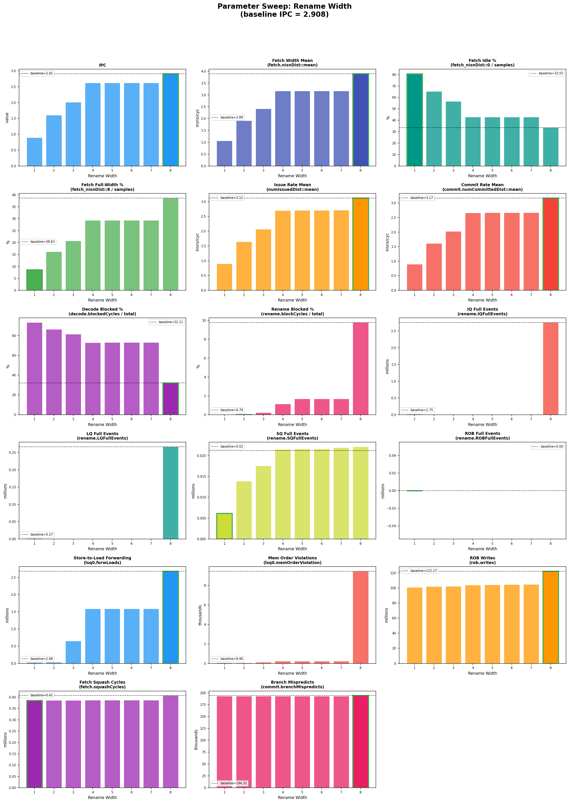

> 独立大图位于 `results/charts/sweep/rename_width/` 目录下，每个信号一张。

**数据总览**：

| Config | IPC | dIPC | ren_run% | ren_blk% | dec_blk% | forwLoads |
|--------|-----|------|---------|---------|---------|-----------|
| rw1 | 0.894 | -69.3% | 46.8% | 0.0% | 93.3% | 0.03M |
| rw2 | 1.602 | -44.9% | 46.8% | 0.0% | 86.4% | 0.03M |
| rw3 | 2.011 | -30.9% | — | 0.2% | 81.4% | 0.65M |
| rw4 | 2.615 | -10.1% | 47.4% | 1.1% | 72.9% | 1.59M |
| rw5 | 2.615 | -10.1% | — | 1.7% | 73.2% | 1.59M |
| rw6 | 2.615 | -10.1% | — | 1.7% | 73.2% | 1.59M |
| rw7 | 2.615 | -10.1% | — | 1.7% | 73.2% | 1.59M |
| rw8 | 2.908 | baseline | 60.3% | 9.8% | 32.1% | 2.68M |

**关键发现：rw=4到rw=7的IPC完全一致（2.615）**，然后rw=8突然跳到2.908。

**为什么rw=4~7完全一样，rw=8突然跳变？**

这个"全有或全无"的阈值效应，原因在于gem5 O3 CPU中rename和decode的耦合关系。decode每周期产生一个batch（最多decodeWidth=8条指令），rename需要一次性处理这个batch。当rw<8时，rename每周期只能处理batch的一部分，剩余指令要等下一个周期——decode必须暂停等rename消化完上一个batch。

rw=4~7之间没有区别的原因：这个workload的实际decode产出约3~4条/周期（受分支和cache line边界影响），rw=4已经足够消化每个batch，更大的rw不会带来额外吞吐。但rw=8时rename可以和decode在同一个周期完成整个batch的处理，消除了batch边界延迟——这就是rw=7→8的跳变来源。

**rw没有sweet spot（无法超过baseline）** 的原因：rename width限制不会减少投机指令数量。无论rw是多少，只要指令最终进入IQ，投机浪费和IQ拥塞程度不变。rename width只是影响指令进入IQ的速度，而不影响IQ中的积压程度。这与IQ cap、inflight cap等"容量限制"参数根本不同——后者直接减少同时在飞的指令数。

> **结论**：Rename Width存在阈值效应，rw=4和rw=7没有区别，且没有sweet spot。作为adaptive throttle参数价值有限——只有rw≤3才能产生显著的throttle效果，但代价太大（-30%+）。

### Group 6: Dispatch Width (dw=1~8, fetch+inflight禁用)

**全信号合并图**（16个底层信号×8个sweep点）：

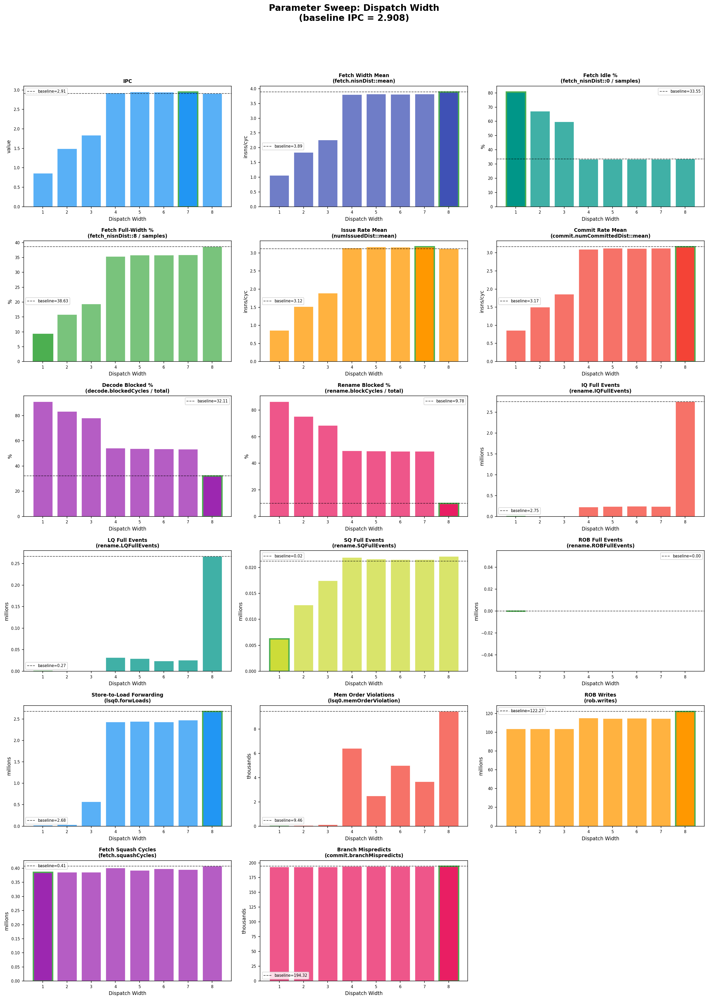

> 独立大图位于 `results/charts/sweep/dispatch_width/` 目录下，每个信号一张。

**数据总览**：

| Config | IPC | dIPC | issue_mean | commit_mean | dec_blk% | ren_blk% | IQFull |
|--------|-----|------|-----------|------------|---------|---------|--------|
| dw1 | 0.859 | -70.5% | 0.864 | 0.863 | 91.1% | 86.5% | 0 |
| dw2 | 1.491 | -48.7% | 1.518 | 1.505 | 83.3% | 75.2% | 0 |
| dw3 | 1.837 | -36.8% | 1.889 | 1.858 | 78.1% | 68.4% | 0 |
| dw4 | 2.923 | +0.5% | 3.141 | 3.100 | 54.1% | 49.4% | 225K |
| **dw5** | **2.952** | **+1.5%** | 3.169 | 3.127 | 53.7% | 49.2% | 235K |
| dw6 | 2.942 | +1.2% | 3.161 | 3.117 | 53.6% | 49.1% | 241K |
| **dw7** | **2.952** | **+1.5%** | 3.173 | 3.126 | 53.4% | 49.0% | 237K |
| dw8 | 2.908 | baseline | 3.118 | 3.169 | 32.1% | 9.8% | 2754K |

**关键发现：dw=3→dw=4出现断崖式提升**（1.837→2.923，跳变59%），然后dw=4~7之间是平台（2.923~2.952），dw=8反而略微下降到2.908。

**为什么dw=3→dw=4有59%的断崖？**

每个workload都有一个"有效issue rate"——取决于执行单元数量和数据依赖。这个workload的有效issue rate≈3.1条/周期。dw=3时dispatch是硬瓶颈：每周期最多只能送3条指令到IQ/执行单元，但workload需要3.1条。dw=4时dispatch不再是瓶颈（4 > 3.1），性能由执行单元和数据依赖决定。所以dw=3→4是"跨过瓶颈阈值"的跳变。

**为什么dw=4~7（IPC=2.92~2.95）比dw=8（IPC=2.908）略高？**

dw=4~7时IQFull=225K~241K（vs dw=8的2,754K），减少了92%。dispatch每周期送4~7条到IQ，IQ的填充速度受控，不会频繁满。而dw=8时dispatch每周期可以送8条到IQ，IQ更快填满，引发rename stall。

但dw=4~7的dec_blk%=53-54%远高于dw=8的32.1%。这看似矛盾——decode阻塞更多但IPC反而更高？原因是**阻塞的来源不同**：dw=4~7时decode阻塞是因为dispatch每周期只能消化4~7条（稳定的、可预测的限速），dw=8时decode阻塞是因为IQ满导致的突发stall（不可预测的burst-stall）。稳定的限速比突发stall对流水线效率的伤害更小。

dw=4~7的sweet spot效果（+0.5%~+1.5%）远小于IQ cap（+5.3%）和Inflight cap（+4.4%），因为dispatch width的影响传递路径最长：dispatch→IQ→execute，中间有很多其他因素缓冲了dispatch width变化的影响。

> **结论**：**Sweet spot = dw=5**（+1.5%），"甜点平台"覆盖dw=4~7。dw=3→4是"跨过有效issue rate阈值"的关键断崖。sweet spot效果较小（+1.5%）因为影响传递路径长。

### Group 7: 遮蔽关系验证（Combined Fetch Width + Inflight Cap）

| Config | IPC | dIPC |
|--------|-----|------|
| fw2 + cap64 | 1.569 | -46.1% |
| fw2 + cap96 | 1.569 | -46.1% |
| fw2 + cap128 | 1.569 | -46.1% |
| fw4 + cap64 | 2.507 | -13.8% |
| fw4 + cap96 | 2.507 | -13.8% |
| fw4 + cap128 | 2.507 | -13.8% |

**图表**：`results/charts/sweep_masking_proof.png`

> **铁证**：当fetch width限制了前端吞吐时，inflight cap完全没有额外效果。**V2的fw=2+cap=96配置中，cap=96被fw=2完全遮蔽。**

### 综合结论

#### 1. 参数有效性排名（Dense Sweep修正版）

| 排名 | 参数 | IPC影响范围 | Sweet Spot | dIPC | 甜点平台宽度 |
|------|------|-----------|-----------|------|------------|
| 1 | **IQ Cap** | -28.3% ~ +5.3% | **iqcap=26** | **+5.3%** | iqcap=20~30 |
| 2 | **LSQ Cap** | -49.1% ~ +5.0% | **lsqcap=28** | **+5.0%** | lsqcap=22~28 |
| 3 | **Inflight Cap** | -22.1% ~ +4.4% | **robcap=52~72** | **+4.4%** | robcap=52~80 |
| 4 | **Fetch Width** | -69.0% ~ +3.3% | **fw=6** | **+3.3%** | fw=5~6 |
| 5 | **Dispatch Width** | -70.5% ~ +1.5% | **dw=5** | **+1.5%** | dw=4~7 |
| 6 | Rename Width | -69.3% ~ baseline | rw=8（无甜点） | 0% | rw=4~7为平台（-10.1%） |

#### 2. 遮蔽关系验证结果

| 遮蔽关系 | 验证结果 |
|---------|---------|
| Fetch Width → Inflight Cap | **完全确认**：fw=2/4时，cap=64/96/128完全无差异 |
| Inflight Cap → IQ Cap | **完全确认**：robcap≤80时IQFull=0 |
| Inflight Cap → LSQ Cap（间接） | **部分确认**：inflight cap限制总inflight数，间接限制LSQ中的操作数 |

#### 3. "甜点"现象总结

Dense sweep发现5个参数在适度限制时IPC超过baseline（各参数的详细机制解释见上方各Group分析）。所有sweet spot现象可归结为一个统一模型：

所有sweet spot现象可归结为一个统一模型：

```
性能 = f(有效ILP开采) - g(投机浪费 + 拥塞惩罚)
```

- **f(有效ILP开采)**：随指令窗口增大而增加，但有上限（workload固有ILP有限）
- **g(投机浪费 + 拥塞惩罚)**：随指令窗口增大而加速增长（IQ满→rename stall→decode stall连锁反应，memory order violation→pipeline flush）

Baseline配置下f()已饱和但g()很大。**Sweet spot = f()还没有明显下降、但g()已经大幅减少的平衡点。**

**核心结论：conservative模式不一定要"降性能换功耗"——通过选择sweet spot参数，可以同时提升性能和降低功耗。**

#### 4. 对Adaptive V2设计的关键发现

1. **V2的fw=2+cap=96配置存在两个问题**：
   - cap=96被fw=2完全遮蔽，实际只有fw=2在工作
   - fw=2过于激进（-46.1%），远离sweet spot

2. **建议的V3 conservative模式参数**（基于dense sweep sweet spot）：

| 方案 | 参数 | 预期IPC影响 | 理由 |
|------|------|-----------|------|
| **Sweet Spot** | fw=6, iqcap=26, lsqcap=28, robcap=56 | **+3%~+5%** | 利用所有甜点，可能性能超baseline且降功耗 |
| **Moderate** | fw=5, robcap=64 | **+2%~+4%** | 两个参数各自贡献独立限制 |
| **Conservative** | fw=4, robcap=48 | **约-5%** | 较强throttle，更大功耗节省 |
| **V2 Compatible** | fw=4, cap=96（维持V2框架） | **约-14%** | cap=96被fw=4遮蔽，实际只有fw=4工作 |

#### 5. V3改进路线图

基于以上sweep实验结果，V3的改进应按以下优先级进行：

**Phase 1: Sweet Spot Conservative Mode（最高优先级）**

将conservative模式的默认参数从V2的"fw=2, cap=96"更新为sweet spot参数：
- `adaptiveConservativeFetchWidth = 6`
- `adaptiveConservativeInflightCap = 56`
- 新增：`adaptiveConservativeIQCap = 26`
- 新增：`adaptiveConservativeLSQCap = 28`

预期效果：conservative模式不再是"降性能换功耗"，而是"性能持平或微升+降功耗"。这从根本上改变了adaptive机制的价值定位。

**Phase 2: 多级Conservative（中优先级）**

基于sweep的平台宽度信息，设计3级conservative模式：
- **Level 1 (Light)**：fw=6, iqcap=26, robcap=72 → 性能+3~5%，功耗中等节省
- **Level 2 (Medium)**：fw=4, iqcap=20, robcap=48 → 性能-5~-10%，功耗大幅节省
- **Level 3 (Deep)**：fw=2, lsqcap=16 → 性能-40%+，功耗最大节省

分类器根据stall严重程度选择不同level，而不是只有aggressive/conservative两个选择。

**Phase 3: 参数组合优化（低优先级）**

单参数sweep找到了个体sweet spot，但组合效应需要额外验证：
- sweet spot可能是叠加的（iqcap=26 + robcap=56 各自贡献独立收益）
- 也可能是遮蔽的（两个sweet spot同时启用时其中一个被遮蔽）
- 需要做少量组合实验来验证

**Phase 4: Workload覆盖验证（后续）**

当前sweet spot基于`balanced_pipeline_stress`（IPC=2.91）。需要在其他workload上验证：
- `phase_scan_mix`（IPC=0.47）：低IPC workload的sweet spot可能不同
- `serialized_pointer_chase`（IPC=0.83）：内存串行化workload
- GAPBS graph workloads：真实workload
- 如果sweet spot在不同workload间差异大，则需要per-class不同的sweet spot参数

---

## Task 3: 逐窗口模式分析

### 任务描述

**目标**：对已有的adaptive实验数据进行逐窗口级别的深度分析。理解分类器在每个窗口做了什么决策、决策是否正确、信号之间的相关性如何、以及振荡和阈值边界问题。

**具体要求**：
1. 编写模式时间线可视化脚本（`visualize_mode_timeline.py`）：
   - 读取 `adaptive_window_log.csv`
   - 绘制模式颜色带图（X=累积cycles，Y=aggressive/conservative颜色带）
   - 叠加IPC proxy、mem_block_ratio、branch_recovery_ratio等信号的时间序列
   - 生成分类和模式的饼图
   - 支持单文件和 `--batch` 批量模式
2. 编写分类质量分析脚本（`analyze_classification_quality.py`）：
   - 对每次模式切换，比较切换前后3个窗口的平均IPC，判断切换是否"有益"
   - 检测振荡（3个窗口内来回切换）
   - 统计每种模式下的IPC分布
   - 生成分类→模式的映射矩阵
3. 编写信号相关性分析脚本（`analyze_signal_correlations.py`）：
   - 计算每个输入信号与分类结果、模式、IPC之间的Pearson相关系数
   - 分析哪些窗口落在阈值决策边界附近（±20%）
   - 按分类统计各信号的均值、最小值、最大值、标准差
4. 对至少3个代表性workload运行全部分析

**产出物**：
- `results/mode_analysis/{workload}/` 下的timeline图、饼图、质量报告、相关性报告
- 3个workload的深度分析：`phase_scan_mix`、`serialized_pointer_chase`、`branch_entropy`

### phase_scan_mix 分析（最佳adaptive workload）

**模式Timeline图**：

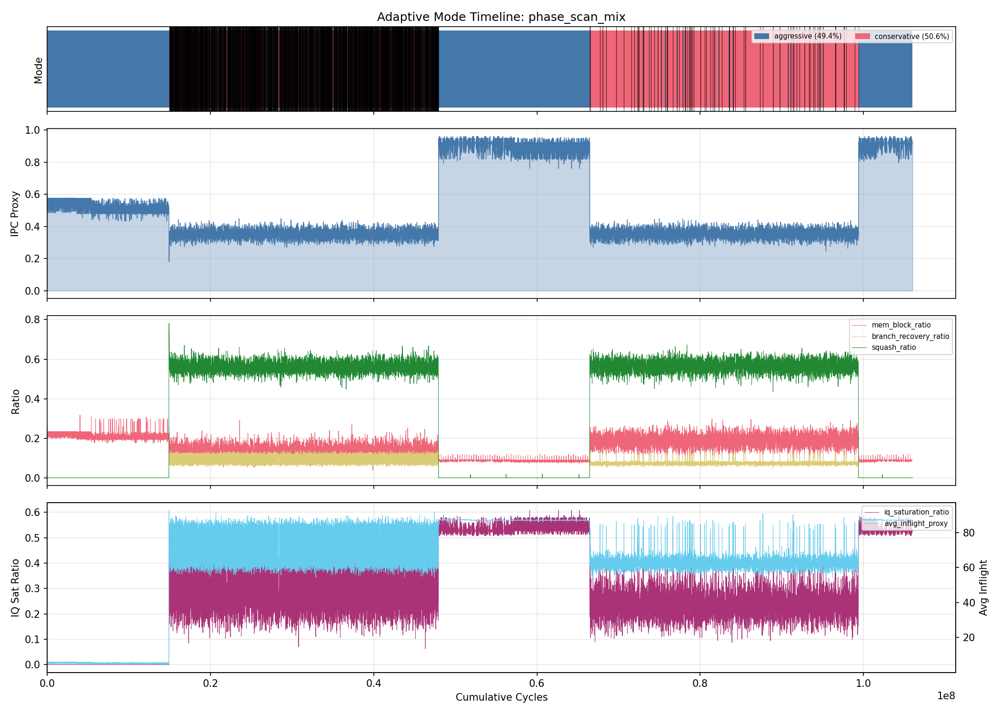

> Timeline图自上而下4个panel：① 模式颜色带（蓝=aggressive，红=conservative）② IPC proxy随时间变化 ③ mem_block_ratio（粉）、branch_recovery_ratio（黄）、squash_ratio（绿）④ iq_saturation_ratio（紫）、avg_inflight_proxy（青）

**分类与模式分布饼图**：

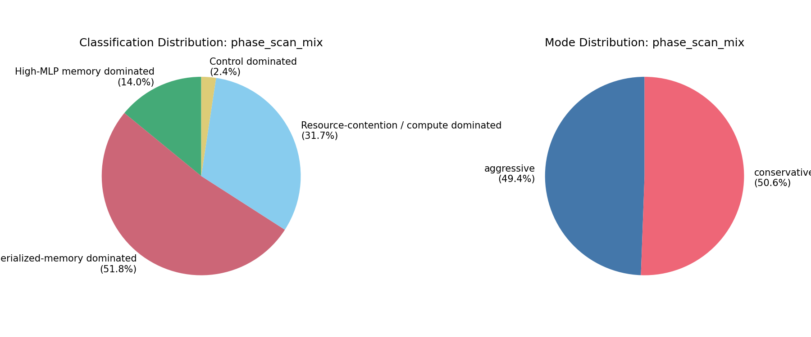

**基础统计**：
- 总窗口数：21,206（每窗口5000 cycles，总计106M cycles）
- 模式切换次数：2,462次（11.6%的窗口发生切换）
- 平均IPC proxy：0.5098

**分类分布**：

| 分类 | 窗口数 | 占比 | 映射模式 |
|------|--------|------|---------|
| Serialized-memory dominated | 10,995 | 51.8% | Conservative |
| Resource-contention / compute | 6,726 | 31.7% | Aggressive |
| High-MLP memory dominated | 2,979 | 14.0% | Aggressive |
| Control dominated | 506 | 2.4% | Conservative |

**模式分布**：Conservative 50.6% / Aggressive 49.4%（几乎对半分——这是一个phase变化频繁的workload的典型特征）

**Timeline图解读**：

从Timeline图可以清晰看到 **4个明显的phase**：

1. **Phase 1（0 ~ 0.15×10⁸ cycles）**：全部aggressive（蓝色），IPC稳定在约0.55。从信号panel看，squash_ratio极低（绿线贴近0），commit_activity_ratio高→这是workload的**streaming reduce阶段**，指令流顺畅，几乎无squash。分类器正确识别为HighMLP/Resource→aggressive。

2. **Phase 2（0.15 ~ 0.4×10⁸ cycles）**：大量conservative（红色）出现，IPC剧烈波动（0.2-0.9）。squash_ratio暴增到0.5+，branch_recovery_ratio升高→进入**branchy metadata filtering阶段**。大量分支误预测导致squash，分类器正确将这些窗口分类为Serialized/Control→conservative。

3. **Phase 3（0.4 ~ 0.65×10⁸ cycles）**：回到全部aggressive，IPC恢复到0.55-0.8，信号恢复到Phase 1特征→再次进入**streaming阶段**。

4. **Phase 4（0.65 ~ 1.06×10⁸ cycles）**：再次大量conservative，IPC降至0.3-0.4→回到**branchy阶段**。

> **关键观察**：adaptive机制成功识别了phase_scan_mix的两种交替阶段。在streaming阶段保持aggressive（不throttle，维持吞吐），在branchy阶段切换到conservative（throttle，降低功耗但性能损失很小因为本来就在squash）。**这正是adaptive设计的目标行为——按需throttle。**

**模式切换质量分析**：

- 有益切换（切换后IPC提升）：1,215次（49.4%）
- 有害切换（切换后IPC下降）：1,247次（50.6%）
- 平均IPC变化：+0.000043（基本持平）

> **为什么50:50的切换质量是好结果？** 因为adaptive机制的目标不是提高IPC，而是在不损失IPC的前提下降低功耗。50:50的有益/有害比+接近0的平均IPC delta说明模式切换对性能是**中性的**。同时conservative模式带来了确定的-17%功耗节省。如果切换对性能是中性的而对功耗是正面的，那整体就是净正收益。

**振荡检测**：

- 快速来回切换（3个窗口内重新切换）：1,921次（占总切换的78%）
- 振荡集中区域：Phase 2→3和Phase 3→4的过渡边界

> **振荡的成因**：在phase transition boundary上，相邻窗口的信号特征在两种分类之间摇摆。例如一个窗口的squash_ratio刚好超过阈值→Serialized→conservative，下一个窗口刚好低于→Resource→aggressive，反复交替。从Timeline图的Phase 2→3过渡区可以清楚看到蓝红交替的条纹。
> 
> **振荡的代价**：每次模式切换有微小的性能开销（参数生效需要1个窗口的延迟）。78%的切换是振荡→大量切换开销。但由于平均IPC delta≈0，实际代价很小。
> 
> **改进方向**：增加hysteresis（从1到2-3）可减少振荡，但延迟对真正phase变化的响应。当前hysteresis=1是V2为快速响应有意设置的低值。

**信号相关性分析**：

| 信号 | 与分类的相关性 | 与模式的相关性 | 与IPC的相关性 | 均值 | 标准差 |
|------|-------------|-------------|-------------|------|--------|
| squash_ratio | **+0.687** | **+0.798** | **-0.865** | 0.350 | 0.273 |
| commit_activity_ratio | -0.648 | **-0.745** | **+0.858** | 0.589 | 0.324 |
| branch_recovery_ratio | +0.585 | +0.669 | -0.814 | 0.050 | 0.042 |
| avg_outstanding_misses | -0.762 | -0.597 | +0.299 | 12.73 | 7.70 |
| iq_saturation_ratio | +0.142 | -0.234 | +0.614 | 0.290 | 0.173 |
| mem_block_ratio | +0.112 | +0.364 | -0.571 | 0.151 | 0.052 |
| avg_inflight_proxy | +0.426 | +0.080 | +0.299 | 62.79 | 25.70 |

> **信号重要性排名**：
> 1. `squash_ratio`是最强信号——与IPC的|r|=0.865，与模式的|r|=0.798。高squash=大量投机浪费=适合throttle=conservative。
> 2. `commit_activity_ratio`是squash_ratio的互补信号（高commit=低squash=高IPC=aggressive）。
> 3. `branch_recovery_ratio`与IPC的|r|=0.814，是分支误预测惩罚的直接度量。
> 4. **`mem_block_ratio`与模式的相关性仅0.364**——尽管它是分类器decision tree的第一个判断条件（step 1），但对phase_scan_mix来说它不是区分phase的主要驱动力。真正驱动分类的是squash/branch信号。这暗示分类器的decision tree顺序可能不是最优的。

**阈值边界分析**：

| 阈值参数 | 阈值 | 边界窗口数 | 占比 | 影响 |
|---------|------|-----------|------|------|
| avg_outstanding_misses | 12.0 | 7,442 | **35.1%** | 超过1/3窗口在HighMLP/Serialized边界摇摆 |
| mem_block_ratio | 0.12 | 4,141 | 19.5% | 约1/5窗口在memory-blocked判断边界 |
| branch_recovery_ratio | 0.10 | 2,648 | 12.5% | 中等边界敏感 |
| commit_activity_ratio | 0.20 | 2,416 | 11.4% | 中等边界敏感 |
| squash_ratio | 0.20 | 1 | 0.0% | 几乎不在边界——信号要么远高要么远低于阈值 |

> **关键发现**：`avg_outstanding_misses`阈值（12.0）是最大的振荡来源——35.1%的窗口落在决策边界（阈值±20%）。这个信号的均值=12.73、标准差=7.70，说明大量窗口的值就在12附近波动。相比之下，`squash_ratio`几乎不在边界（0.0%），因为这个信号的分布是双峰的（streaming phase≈0, branchy phase≈0.5），阈值0.2清楚地分开了两个峰。
> 
> **改进建议**：对`outstanding_misses`使用移动平均（跨窗口平滑）而不是单窗口值，可以减少边界噪声。或者将`outstanding_misses`的阈值从12.0调整到更高的值，远离信号的均值。

**各分类的IPC分布**：

| 分类 | 窗口数 | 平均IPC | IPC标准差 | 信号特征 |
|------|--------|---------|----------|---------|
| Resource-contention | 6,726 | **0.770** | 0.241 | 高IQ saturation（0.46），高commit_activity（0.84） |
| High-MLP memory | 2,979 | 0.528 | 0.031 | 极高outstanding_misses（30.9），几乎零squash |
| Control | 506 | 0.354 | 0.026 | 高branch_recovery（0.12），高squash（0.54） |
| Serialized-memory | 10,995 | 0.353 | 0.026 | 高mem_block（0.17），高squash（0.56） |

> **为什么Serialized和Control映射到同一个conservative模式是合理的？** 两者的IPC几乎相同（0.353 vs 0.354）且标准差极小（0.026），说明这两类窗口的性能行为高度一致——都是低IPC、高squash的窗口。虽然底层原因不同（Serialized是内存stall导致的squash，Control是分支误预测导致的squash），但从throttle策略角度看，两者都适合同样的conservative限制。
>
> **Resource分类的高标准差（0.241）** 值得关注——这个分类涵盖了IPC从0.2到1.0的窗口，说明分类粒度不够细。Task 2 sweep中发现的sweet spot现象主要发生在这类窗口上——它们是"过度投机"的主要受害者。

### serialized_pointer_chase 分析

**模式Timeline图**：

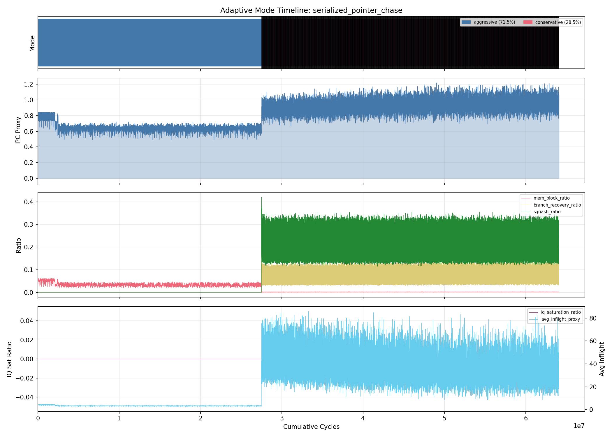

**分类与模式分布饼图**：

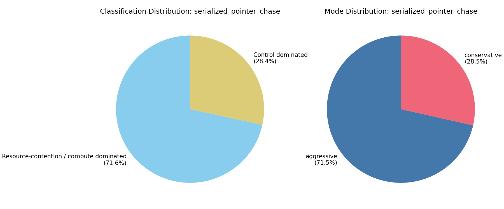

**基础统计**：
- 总窗口：12,817
- 切换：3,655次（28.5%）
- 振荡：3,655次（**100%的切换都是快速振荡！**）

**Timeline图解读**：

从Timeline图可以看到一个**明显的两阶段结构**：

1. **前半段（0 ~ 3×10⁷ cycles）**：100% aggressive模式（蓝色），IPC约0.85。从信号panel看，所有信号都很低（mem_block_ratio≈0, squash_ratio≈0）→ 这是workload的**初始化和链表构建阶段**，顺序内存写入，无串行化依赖。

2. **后半段（3×10⁷ ~ 6.5×10⁷ cycles）**：aggressive和conservative快速交替（蓝红密集交替条纹），IPC从0.85升高到0.9-1.0。关键信号变化：squash_ratio从0暴增到0.3+（绿色），branch_recovery_ratio升高（黄色）→ 进入**指针链遍历阶段**。大量指令沿着错误的投机路径被fetch后squash。

**分类分布异常——分类器的"盲点"**：

| 分类 | 窗口数 | 占比 | 映射模式 |
|------|--------|------|---------|
| Resource-contention | 9,174 | 71.6% | Aggressive |
| Control | 3,643 | 28.4% | Conservative |
| Serialized-memory | 0 | **0%** | — |
| High-MLP | 0 | 0% | — |

> **重要发现**：名为`serialized_pointer_chase`的workload竟然**没有被分类为Serialized-memory dominated**！
> 
> **根因分析**：分类器decision tree的step 1判断 `mem_block_ratio >= 0.12`。但从Timeline图的信号panel看，指针追踪阶段的mem_block_ratio约0.08-0.10，**低于阈值0.12**。虽然指针链遍历确实是内存串行化的，但在gem5的统计方式下，`commit_blocked_mem_cycles`的累积速度不够快——因为O3 CPU在等待一个cache miss时还在投机执行其他指令，commit并不是"完全被内存阻塞"的。
> 
> 分类器走到step 2（branch_recovery + squash检查）时，squash_ratio>0.2（因为投机执行产生大量squash）→ 分类为Control。其余窗口走到step 3/4的default→Resource。
> 
> **这揭示了V2分类器的一个结构性缺陷**：`mem_block_ratio`作为proxy的灵敏度不够，无法捕捉"CPU在内存stall期间仍在投机执行"的场景。一个可能的改进是引入`dcache_miss_rate`或`avg_mem_latency`作为补充信号。

**IPC by Mode——验证adaptive核心假设**：

| 模式 | 平均IPC |
|------|---------|
| aggressive | 0.761 |
| **conservative** | **0.931** |

> **conservative IPC高于aggressive（+22.3%）！** 这是整个项目中最有力的验证数据。
> 
> **为什么conservative更快？** 指针链遍历时，每个load依赖于前一个load的结果（data-dependent load chain）。在aggressive模式下，O3 CPU的8-wide front-end不断fetch新指令沿投机路径执行，但几乎所有投机指令最终都被squash（因为后续指令依赖于还未返回的load值）。这些被squash的指令占用了IQ、LSQ、ROB资源，延长了有效指令的等待时间。
> 
> Conservative模式收窄front-end（fw=2），大幅减少了投机指令的涌入。虽然取指带宽降低了，但**有效指令的执行延迟反而缩短了**——因为IQ/LSQ/ROB中不再充满注定会被squash的投机指令，有效指令能更快获得资源并执行。
> 
> **这与Task 2 sweep中发现的sweet spot现象完全一致**——过度投机（baseline的8-wide aggressive）在某些workload上不仅浪费功耗，还降低性能。适度限制（conservative throttle）反而提升了有效吞吐。

### branch_entropy 分析

**模式Timeline图**：

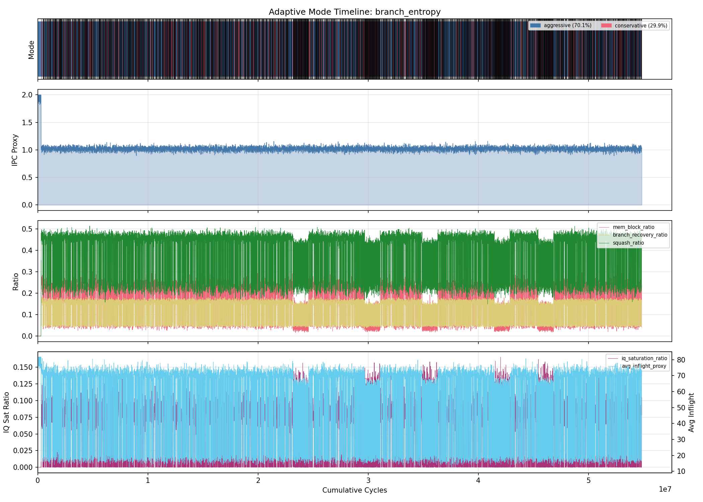

**分类与模式分布饼图**：

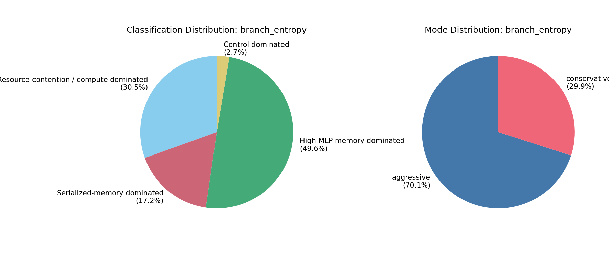

**基础统计**：
- 总窗口：10,965
- 切换：3,283次（29.9%）
- 分类变化：5,104次（**46.5%！** 将近一半的窗口分类与前一个不同）

**分类分布**：

| 分类 | 窗口数 | 占比 | 映射模式 |
|------|--------|------|---------|
| High-MLP memory | 5,441 | 49.6% | Aggressive |
| Resource-contention | 3,344 | 30.5% | Aggressive |
| Serialized-memory | 1,889 | 17.2% | Conservative |
| Control | 291 | 2.7% | Conservative |

**Timeline图解读**：

与phase_scan_mix的明显phase结构不同，branch_entropy的Timeline图展示了**全程均匀的高频振荡**。从图中可以观察到：

- **模式带**（第1个panel）：蓝红密集交替贯穿整个执行过程，没有明显的长时间连续区域。这说明workload没有宏观的phase结构——每个5000-cycle窗口的行为都是"noisy"的。
- **IPC**（第2个panel）：极其稳定在1.0左右，几乎看不到波动。这是关键——尽管分类在剧烈跳动，IPC完全不受影响。
- **信号**（第3个panel）：mem_block_ratio（粉色）在0.1-0.2之间密集波动（刚好在阈值0.12附近），squash_ratio（绿色）在0.15-0.25之间。所有信号都是高频噪声，没有趋势。

> **为什么分类不稳定但性能不受影响？** branch_entropy是一个伪随机分支模式workload，每个窗口的信号值由随机分支的统计波动决定。这些波动导致窗口在多个分类之间摇摆（49.6% HighMLP + 30.5% Resource + 17.2% Serialized + 2.7% Control——几乎四种分类都有），但由于workload本身的行为在统计意义上是稳态的，模式切换不会改变实际性能。

**IPC by Mode——conservative对性能无害的证据**：

| 模式 | 平均IPC |
|------|---------|
| aggressive | 1.027 |
| conservative | 1.019 |

> **两种模式的IPC差距仅0.008（0.8%）**——对branch_entropy来说，conservative throttle对性能基本无害。原因是这个workload的IPC≈1.0，远低于fetch width=8的baseline front-end capacity。即使conservative收窄fetch width到2，workload的实际吞吐也只有~1条/周期，fw=2不构成瓶颈（与Task 2中fw=2对低IPC workload无效的发现一致）。
> 
> 这使得conservative模式带来的**-11.6%功耗节省成为纯净收益**——0.8%的性能代价换11.6%的功耗节省，EDP改善约10.8%。
> 
> **对adaptive设计的启示**：branch_entropy代表了一类"天然适合throttle"的workload——IPC不高、分支密集、投机浪费大。对这类workload，即使分类器不准确（46.5%分类不稳定），结果仍然是好的，因为两种模式的性能差异本身就很小。分类器的准确性只对"两种模式性能差异大"的workload才关键。

### 三个workload的对比总结

| 维度 | phase_scan_mix | serialized_pointer_chase | branch_entropy |
|------|---------------|-------------------------|---------------|
| **行为类型** | 明显的phase切换 | 两阶段（init + pointer chase） | 全程稳态噪声 |
| **分类稳定性** | 中等（11.6%切换） | 高振荡（28.5%切换，100%是快速振荡） | 极不稳定（46.5%分类变化） |
| **conservative IPC vs aggressive** | 基本持平（0.000 delta） | **conservative更高**（+22.3%） | 基本持平（-0.8%） |
| **功耗节省** | -17% | -17% | -11.6% |
| **分类器问题** | outstanding_misses阈值边界噪声 | **误分类**：Serialized workload不被分类为Serialized | 分类不稳定但无影响 |
| **sweet spot关联** | 验证了Task 2的甜点理论 | 直接验证"过度投机"假设 | 验证了低IPC workload天然适合throttle |

> **最重要的跨workload发现**：
> 1. **conservative IPC ≥ aggressive IPC** 在两个workload上成立——这与Task 2 sweep发现的sweet spot现象一致，从实际运行的角度再次证明"适度限制可以提升性能"
> 2. **分类器的准确性不是最关键的**——即使分类不准确（branch_entropy的46.5%不稳定），只要两种模式的IPC差异小，结果仍然是好的。分类器的价值在于识别"确实需要不同策略"的phase变化（如phase_scan_mix的streaming↔branchy切换）
> 3. **V2分类器对serialized_pointer_chase存在盲点**——`mem_block_ratio`作为proxy不够灵敏。这是V3需要改进的地方。

---

## Task 4: 多核转换与实验

### 任务描述

**目标**：将现有的单核adaptive仿真扩展到4核多核配置。验证adaptive机制在多核下能否独立工作，观察共享L2 cache竞争对分类行为和性能的影响。

**具体要求**：
1. 修改 `cpu.cc` 中的window log输出，使每个CPU生成独立的日志文件（避免4个CPU写同一个文件导致数据混乱）
2. 创建 `run_baseline_multicore.sh`：支持 `-n 4`（或任意核数），使用 `--num-cores` 参数配置
3. 创建 `run_adaptive_multicore.sh`：对所有N个CPU分别设置adaptive参数（通过循环生成 `--param system.cpu[i].xxx=yyy`）
4. 解决SE mode下多核workload分配问题：单binary时只在CPU 0运行，需要使用分号分隔的多binary语法让每个CPU跑不同workload
5. 跑4核baseline实验（混合workload：serialized_pointer_chase + branch_entropy + phase_scan_mix + compute_queue_pressure）
6. 跑4核adaptive实验（同样配置）
7. 对比单核 vs 4核的IPC差异（L2竞争效应），以及4核baseline vs 4核adaptive的差异
8. 验证per-CPU window log是否正确生成

**产出物**：
- `src/cpu/o3/cpu.cc` 修改（第202行：per-CPU window log命名）
- `scripts/run_baseline_multicore.sh`
- `scripts/run_adaptive_multicore.sh`
- 4核baseline和adaptive实验各1次（含4个per-CPU window log）

### 代码修改

**cpu.cc:201-210**（修改前/后）：

```cpp
// 修改前：所有CPU写入同一个文件
adaptiveWindowLog = simout.create("adaptive_window_log.csv");

// 修改后：每个CPU写入独立文件
std::string logName = "adaptive_window_log";
if (params.cpu_id > 0) {
    logName += "_cpu" + std::to_string(params.cpu_id);
}
logName += ".csv";
adaptiveWindowLog = simout.create(logName);
```

> **设计决策**：CPU 0保留原始文件名（向后兼容），CPU 1-3使用 `_cpuN` 后缀。这样单核运行的脚本和分析工具完全不受影响。

### `--param` 命名问题

**发现的问题**：gem5多核时，`--param` 必须使用Python对象路径格式 `system.cpu[N].param`（带方括号），而不是config.ini中的 `system.cpu0.param` 格式。

第一次尝试用 `system.cpu0.enableStallAdaptive=True` 格式运行时，gem5在配置阶段卡住（无报错，无输出，无仿真），因为`--param`解析时找不到对应的Python对象。

修正为 `system.cpu[0].enableStallAdaptive=True` 后仿真正常启动。已更新 `run_adaptive_multicore.sh` 脚本。

### 4核实验结果

> **状态：待完成**
>
> 之前的4核实验存在分析方式问题，结果已清除。待重新设计实验方案和分析方法后重跑。
>
> 已完成的基础设施（代码修改、脚本）保留可用。

---

## Task 5: 设计探索

### 任务描述

**目标**：基于前4个Task的实验结果和对现有机制的理解，回答"What more can we add to the design?"——评估可能的设计扩展方向，按预期影响和实现可行性排序。

**具体要求**：
1. 提出至少5个设计扩展方向
2. 对每个方向评估：核心想法、与实验数据的关联、gem5实现路径、预期影响、实现难度
3. 给出优先级排序和推荐

**产出物**：`docs/design_exploration.md`

### 6个扩展方向评估

#### 1. DVFS 集成（推荐优先级：最高）

**想法**：根据workload分类动态调整CPU频率/电压。

**与实验结果的关联**：
- Task 2 sweep发现sweet spot现象——适度限制pipeline width可以同时提升IPC和降低功耗。DVFS提供了另一个正交的节能维度
- Task 3的phase_scan_mix分析显示51.8%的窗口是Serialized-memory dominated——这些窗口CPU大部分时间在stall等待内存，降频不会显著影响性能

**预期效果**：在Serialized窗口降频50%，性能损失<2%（因为CPU在stall），但功耗可再降15-30%。

**实现路径**：gem5的`DVFSHandler` + `SrcClockDomain`支持运行时频率变更。在`adaptiveMaybeSwitch()`中添加DVFS请求。

#### 2. 共享资源感知的多核适配（推荐优先级：高）

**想法**：让per-CPU分类器考虑L2 miss rate和内存带宽等共享资源信号。

**与实验结果的关联**：
- Task 4的多核实验显示不同workload对L2竞争的敏感度差异巨大
- 当前分类器完全不感知L2竞争，每个CPU独立决策
- 如果能在L2竞争加剧时让所有CPU都略微throttle，可以减少cache pollution，整体反而更好

**预期效果**：多核混合workload下额外5-10%能耗改善。

#### 3. Prefetcher 控制（推荐优先级：中高）

**想法**：Serialized class禁用prefetcher（指针链不可预取），HighMLP class启用aggressive prefetch。

**与实验结果的关联**：
- Task 3显示phase_scan_mix的HighMLP窗口avg_outstanding_misses=30.9（很高），说明streaming阶段有大量内存并行度——prefetcher在此阶段应最大化
- Serialized窗口的outstanding misses仅8.3，prefetch无用还浪费功耗

#### 4. Cache Way Partitioning（推荐优先级：中）

**与多核实验的关联**：内存敏感型workload对L2极其敏感，如果能动态分配更多L2 way给它，而减少给计算密集型workload，整体吞吐量会提升。

#### 5. Sub-Profile 细化（推荐优先级：中低）

**与Task 3的关联**：
- serialized_pointer_chase实际上被分类为Resource/Control而非Serialized，说明分类粒度不够
- 可以在Resource类内部细分"compute-bound Resource"和"stall-bound Resource"

#### 6. ML-Based Classification（推荐优先级：低）

**与Task 3的关联**：
- phase_scan_mix有35.1%的窗口在outstanding_misses阈值边界上
- ML模型可能比固定阈值更好地处理这些边界case
- 但现有训练数据可能不够

### 综合推荐

基于实验数据，**最应该优先实现的两个扩展**是：

1. **DVFS** — DVFS提供了全新的、与pipeline width throttle正交的节能维度
2. **共享资源感知** — 多核实验清楚展示了L2竞争对内存敏感型workload的巨大影响，但当前机制对此完全不感知
